# Plan de PRs: chunks 125 + acumulador phone + háptica controlada

## Contexto y arquitectura final

```mermaid
flowchart LR
    sensor[Sensor 25Hz] --> watchBuf[Watch buffer 125]
    watchBuf -->|"chunk 125 floats LE (~5s)"| dataLayer["/osd/accel_data"]
    dataLayer --> phoneListener[Phone Listener Service]
    phoneListener --> phoneBuf[Phone CircBuf 750]
    phoneBuf -->|count >= 750| infer[TFLite Inference]
    infer --> alarmState["/osd/alarm_state"]
    alarmState --> hapticGuard[AlarmStateManager + debounce]
    hapticGuard --> vibrator[Vibrator]
```

Cada PR habilita el siguiente sin romper lo anterior. Orden no negociable: contrato -> phone -> watch -> haptica -> E2E.

## Reglas globales (aplican a todos los PRs)

- 1 PR = 1 objetivo tecnico, max 1 decision arquitectonica nueva.
- Cada PR incluye sus tests.
- Si un PR neto supera ~350 LOC, dividirlo.
- No mezclar refactors cosmeticos con cambios de comportamiento.

---

## PR1 - Contrato de transporte y datos

Branch: `pr/contract-bytes-spec` | Tamano objetivo: 100-200 LOC (docs + tests)

Objetivo: congelar el contrato watch -> phone antes de tocar logica.

Tareas:
- Escribir spec del protocolo (path, payload, chunk size, unidad, frecuencia) en una unica fuente de verdad. Ubicacion sugerida: nueva entrada en [DECISIONS.md](DECISIONS.md) (DEC-035 "Contrato OSD wear-phone") o nuevo `docs/PROTOCOL.md` segun convencion del proyecto.
- Alinear la inconsistencia ya detectada: [CLAUDE.md](CLAUDE.md) linea 220 dice `input (1,125,1)` mientras [wear/src/main/assets/MODELS.md](wear/src/main/assets/MODELS.md) linea 20 dice `(1, 750, 1)`. Definir el valor canonico y dejar uno solo.
- Revisar [README.md](README.md) (lineas 40, 107, 142, 205, 626) para reflejar `chunk_size != model_input_size`.
- Agregar tests de serializacion/deserializacion para chunks de 125 y 750 en [wear/src/test/java/com/seizureguard/wear/data/WearDataLayerManagerTest.kt](wear/src/test/java/com/seizureguard/wear/data/WearDataLayerManagerTest.kt) reusando `floatsToBytes`/`bytesToFloats`.
- Agregar comentario explicito en [wear/src/main/java/com/seizureguard/wear/data/WearDataLayerManager.kt](wear/src/main/java/com/seizureguard/wear/data/WearDataLayerManager.kt) (lineas 14-16, 41-43) marcando que el tamano del payload es variable.

Criterio de aceptacion:
- Una sola fuente de verdad del contrato.
- Tests verdes para 125 y 750 (incluye round-trip y conteo de bytes 500/3000).

---

## PR2 - Receptor en phone + buffer de modelo

Branch: `pr/phone-buffer-accumulator` | Tamano objetivo: 200-350 LOC

Objetivo: que el phone pueda acumular chunks y decidir cuando inferir, sin tocar el watch.

Tareas:
- Activar el listener en [phone/src/main/AndroidManifest.xml](phone/src/main/AndroidManifest.xml) (lineas 35-45 estan comentadas) y crear `phone/src/main/java/com/seizureguard/phone/service/DataLayerListenerService.kt` (extiende `WearableListenerService`, escucha `/osd/accel_data`).
- Crear `phone/src/main/java/com/seizureguard/phone/ml/PhoneCircularBuffer.kt` con `inputSize` configurable (default 750), API similar al [wear/src/main/java/com/seizureguard/wear/ml/CircularBuffer.kt](wear/src/main/java/com/seizureguard/wear/ml/CircularBuffer.kt) pero con metodo `addAll(FloatArray)`.
- En el listener, deserializar payload little-endian y hacer `addAll(chunk)`; inferir solo si `count >= inputSize`. Para este PR la "inferencia" puede ser un stub que loggea o devuelve estado fijo, asi no acoplamos TFLite todavia.
- Responder `/osd/alarm_state` (1 byte: 0/1/2) usando `MessageClient.sendMessage` para no romper el contrato actual del watch.
- Logs estructurados con tags claros: `chunk_received`, `buffer_fill`, `inference_triggered`.
- Tests unitarios: `PhoneCircularBufferTest` (append parcial, completar 750, ventana ordenada) y test del listener parseando `ByteArray` simulado.

Criterio de aceptacion:
- Con feed simulado de 6 chunks * 125, primera "inferencia" (stub) ocurre al completar 750.
- Cada chunk siguiente dispara una nueva inferencia (politica: ventana deslizante de paso 125).

Decision arquitectonica nueva permitida en este PR: politica "inferir cada chunk despues de warm-up". Documentarla en `DECISIONS.md`.

---

## PR3 - Watch envia chunks de 125 cada ~5s

Branch: `pr/watch-125-chunk-sender` | Tamano objetivo: 150-300 LOC

Objetivo: cambiar cadencia de envio en watch, sin tocar modelo ni phone.

Tareas:
- Refactor en [wear/src/main/java/com/seizureguard/wear/service/SeizureMonitorService.kt](wear/src/main/java/com/seizureguard/wear/service/SeizureMonitorService.kt) (alrededor de la linea 416 `onAccelerometerSample` y 459 `onWindowReady`): reemplazar el trigger por `accelerometerBuffer.isFull` (que hoy queda permanentemente true) por un contador explicito que dispare cada 125 muestras.
- Reducir `BUFFER_CAPACITY` (linea 620) a 125 o introducir un buffer chico dedicado al envio. Mantener separadas las constantes "tamano de chunk de transporte" y "tamano de ventana de modelo" (la ventana del modelo ahora vive en phone).
- Mantener `TYPE_ACCELEROMETER` + conversion m/s2 -> milli-g (lineas 145-150 y 418-419) sin cambios.
- Adaptar `isSequentialMode` (lineas 462-468 y 674-685) para numerar muestras de forma continua entre chunks (no reiniciar en cada envio) para validar orden multi-chunk.
- Ajustar tests existentes que asumen 750: [wear/src/test/java/com/seizureguard/wear/ml/CircularBufferTest.kt](wear/src/test/java/com/seizureguard/wear/ml/CircularBufferTest.kt) (linea 44, capacity = 750) y [wear/src/test/java/com/seizureguard/wear/service/SeizureMonitorServiceTest.kt](wear/src/test/java/com/seizureguard/wear/service/SeizureMonitorServiceTest.kt) (lineas 407-428).
- En [wear/src/main/java/com/seizureguard/wear/data/WearDataLayerManager.kt](wear/src/main/java/com/seizureguard/wear/data/WearDataLayerManager.kt) confirmar que `sendAccelData` no asume tamano fijo (ya no lo asume; solo ajustar docstrings).

Criterio de aceptacion:
- Watch emite exactamente 1 mensaje por cada 125 muestras (~5s con sensor estable).
- Phone (PR2) recibe chunks en orden y completa 750 en ~30s.
- No se rompe el limpiado de estado en `ACTION_STOP`/`onDestroy`.

---

## PR4 - Mitigacion de ruido haptico

Branch: `pr/haptics-noise-guard` | Tamano objetivo: 100-180 LOC

Objetivo: evitar que la vibracion contamine la senal del acelerometro.

Tareas:
- Definir politica unica para este PR: `debounce` (no re-disparar mismo `alarmState` consecutivo) + `cooldown` minimo entre vibraciones. Documentar en `DECISIONS.md`.
- Implementar guardas en [wear/src/main/java/com/seizureguard/wear/alarm/AlarmStateManager.kt](wear/src/main/java/com/seizureguard/wear/alarm/AlarmStateManager.kt) (`handleAlarmState` linea 45): trackear `lastAlarmState` y `lastVibrationAtMs`, ignorar repeticiones dentro de la ventana de cooldown.
- Anadir log estructurado al vibrar (timestamp, estado, motivo) para correlacionar offline con ventanas de alta probabilidad.
- Documentar limitacion explicita: "este PR no filtra muestras durante vibracion; ese trabajo queda fuera de scope para no inflar el cambio". Dejarlo en el `DECISIONS.md` y como TODO con referencia.
- Test unitario: `AlarmStateManagerTest` ya existe en [wear/src/test/java/com/seizureguard/wear/alarm/AlarmStateManagerTest.kt](wear/src/test/java/com/seizureguard/wear/alarm/AlarmStateManagerTest.kt); agregar casos de debounce y cooldown.

Criterio de aceptacion:
- Estados identicos consecutivos no producen vibracion repetida en ventana corta.
- Logs permiten reconstruir secuencia de vibraciones para analisis posterior.

---

## PR5 - End-to-end + regresion + limpieza final

Branch: `pr/e2e-regression-docs` | Tamano objetivo: 180-300 LOC

Objetivo: cerrar el circuito con evidencia fuerte de comportamiento.

Tareas:
- Test de integracion en `phone` (Robolectric o test puro JVM): simular 6 chunks de 125 -> verificar ventana de 750 ordenada en `PhoneCircularBuffer` y disparo de inferencia.
- Test de cadencia: feed sintetico a 25Hz simulado -> primera inferencia ~30s, siguientes cada ~5s.
- Actualizar pruebas que aun asumen 3000 bytes fijos por mensaje (ya tocadas en PR1, validar nada quedo huerfano).
- Validar manualmente con logs el retorno `alarm_state` watch <-> phone end-to-end.
- Update final de [README.md](README.md) (diagrama de arquitectura, lineas 40-67), checklist de fase (linea 626 y 630), y `DECISIONS.md` consolidando DECs nuevas.

Criterio de aceptacion:
- Suite verde en `wear` y `phone`.
- Logs E2E muestran cadencia esperada (1 chunk/5s, primera inferencia 30s, posteriores 5s) y contrato consistente.

---

## Notas de riesgo

- **Inconsistencia ya viva**: `CLAUDE.md` (`(1,125,1)`) vs `MODELS.md` (`(1, 750, 1)`). Resolverla SI o SI en PR1, sino el resto del plan se contradice.
- **Phone sin TFLite todavia**: PR2 deja un stub de inferencia para no acoplar dos cambios grandes. La inferencia real (cargar `cnn_v024.tflite` en phone) merece su propio PR posterior, fuera de este plan.
- **Tests del watch que dependen de `BUFFER_CAPACITY = 750`**: PR3 requiere reescribirlos antes de mergear, no despues.